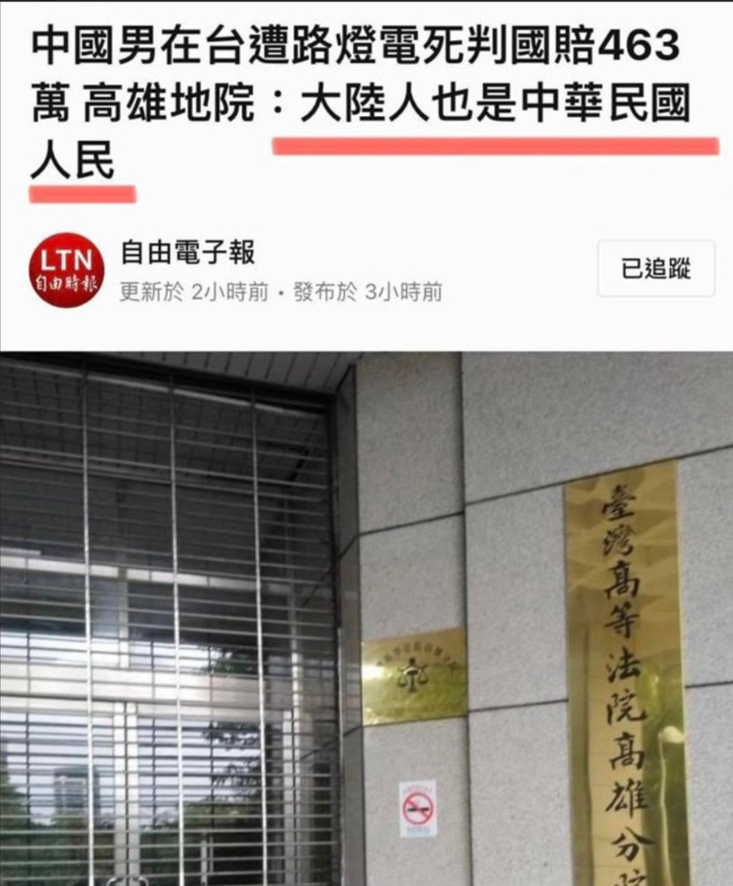

# 感谢来自祖国的认可：“高雄地院：大陆人也是中华民国人民”

> 什么人属于中华民国公民，陆委会为你科普：”依憲法第3條規定，具有中華民國國籍者為中華民國國民。次查國籍法、入出國及移民法規定，中華民國國民係「具有中華民國國籍之居住臺灣地區設有戶籍國民或==臺灣地區無戶籍國民==」” 是不是沦陷区灾胞偷渡过去就可以呢

不管出于什么情况，这也是中华民国的意愿

- 2-17 [大陆男在台被路灯电死获“国家赔偿” 陆委会澄清与国籍无关](https://www.zaobao.com.sg/realtime/china/story20230217-1364187)
- 2-17 [陸委會特予澄清 前函復高雄地院內容並未指稱中國大陸人民為中華民國國民](https://www.mac.gov.tw/News_Content.aspx?n=B383123AEADAEE52&s=045EB9B97EF9809F) 

## “这100个第一美国当之无愧”

每一个都是实际发生的证据确凿的案例

- [全球第一抗疫失败国](https://www.youtube.com/shorts/NifxCCPpPtw)
- [全球第一政治甩锅国](https://www.youtube.com/shorts/NifxCCPpPtw)
- [全球第一疫情扩散国](https://www.youtube.com/shorts/NifxCCPpPtw)
- [全球第一政治撕裂国](https://www.youtube.com/shorts/NifxCCPpPtw)
- [全球第一货币滥发国](https://www.youtube.com/shorts/NifxCCPpPtw)
- [全球第一疫期动荡国](https://www.youtube.com/shorts/NifxCCPpPtw)
- [全球第一虚假信息国](https://www.youtube.com/shorts/NifxCCPpPtw)
- [全球第一溯源恐怖主义国](https://www.youtube.com/shorts/NifxCCPpPtw)
- [全球第一房产烂尾国](https://github.com/WeNeedHome/SummaryOfLoanSuspension)
- [全球第一友善城管国](https://www.youtube.com/results?search_query=%E5%9F%8E%E7%AE%A1%E6%89%93%E4%BA%BA)
- [全球第一免费医疗国](https://haokan.baidu.com/v?pd=wisenatural&vid=11102525444278892635)
- [全球第一民主指数国](https://udn.com/news/story/6809/6943547)
- [全球第一恶意返乡国](https://www.rfi.fr/cn/%E4%B8%AD%E5%9B%BD/20220121-%E4%B8%8D%E8%AE%B8%E6%81%B6%E6%84%8F%E8%BF%98%E4%B9%A1-%E6%83%B9%E6%80%92%E6%97%A0%E6%95%B0%E4%BA%BA)
- [全球第一恶意讨薪国](https://zhuanlan.zhihu.com/p/350923458)
- [全球第一恶意上访国](https://chinadigitaltimes.net/chinese/675985.html)
- [全球第一灵活就业国](https://www.rfa.org/mandarin/yataibaodao/jingmao/hx1-02142022094652.html)
- [全球第一掌控软肋国](https://www.youtube.com/watch?v=snLgcSjYh7k)
- [全球第一影响三代国](https://www.youtube.com/watch?v=fLJHfMGtdJQ)
- [全球第一寻衅滋事国](https://zh.wikipedia.org/zh-hans/%E5%AF%BB%E8%A1%85%E6%BB%8B%E4%BA%8B%E7%BD%AA)
- [全球第一鞋带上吊国](https://www.youtube.com/shorts/CZysSfWXzU0)
- [全球第一高度自治国](https://world.huanqiu.com/article/9CaKrnK3P6v)
- [全球第一為人民服務国](https://telegra.ph/%E6%88%91%E5%9B%BD%E8%B4%A2%E6%94%BF%E4%BE%9B%E5%85%BB%E4%BA%BA%E6%95%B0%E5%B7%B2%E7%BB%8F%E8%B6%858000%E4%B8%87%E6%AF%8F%E5%B9%B4%E4%BE%9B%E5%85%BB%E8%B4%B9%E7%94%A8%E5%8D%A0%E5%85%A8%E5%9B%BD%E8%B4%A2%E6%94%BF%E7%9A%84%E7%99%BE%E5%88%86%E4%B9%8B%E5%9B%9B%E5%8D%81%E5%A4%9A%E9%9C%87%E6%83%8A-02-06)
- [全球第一全过程民主国](https://www.youtube.com/watch?v=iiCleGuXhYU)
- [全球第一計劃生育国](https://www.youtube.com/watch?v=7i3g5XGJQRs)
- [全球第一走私人口国](https://www.rfa.org/mandarin/pinglun/liuqing/lq-12242015121054.html)
- [全球第一器官移植国](https://www.rfa.org/mandarin/pinglun/liuqing/lq-12242015121054.html)
- [全球第一理财盈利国](https://www.nstock.tw/news/article_p2?id=M.1675570527.A.0B3)
- [全球第一存款消失国](https://zh.wikipedia.org/zh-hans/2022%E5%B9%B4%E6%B2%B3%E5%8D%97%E5%A4%9A%E5%AE%B6%E6%9D%91%E9%95%87%E9%93%B6%E8%A1%8C%E5%8F%96%E6%AC%BE%E9%9A%BE%E4%BA%8B%E4%BB%B6)
- [全球第一996福报国](https://github.com/996icu/996.ICU)
- [全球第一防疫灯谜国](https://t.me/CCPNow/369?single)
- [全球第一艾滋染病国](http://www.news.cn/local/2021-12/01/c_1128118369.htm)
- [全球第一耍赖外交国](https://t.me/CCPNow/297?single)
- [全球第一神经病容纳国](https://www.voachinese.com/a/mental-torture-china-is-locking-up-critics-in-psychiatric-facilities-20220816/6703615.html)
- [全球第一自由经商国](http://sn.people.com.cn/n2/2023/0110/c378288-40260655.html)
- [全球第一一票否决国](https://www.ntdtv.com/gb/2022/11/08/a103570175.html)
- [全球第一高价护照国](https://telegra.ph/%E5%8A%9E%E7%90%86%E6%8A%A4%E7%85%A7%E8%A2%AB%E7%82%92%E5%88%B030000%E5%85%83%E5%A4%9A%E4%B8%80%E6%9C%AC%E7%B9%81%E7%90%90%E7%9A%84%E8%B5%84%E6%96%99%E7%AB%9F%E6%88%90%E4%BA%86%E4%B8%AD%E4%BB%8B%E6%8D%9E%E9%87%91%E7%9A%84%E8%B5%84%E6%9C%AC-02-06)
- [全球第一自由迁徙国](https://zh.m.wikipedia.org/zh-hans/%E6%88%B7%E5%8F%A3)
- [全球第一烂尾项目国](https://www.rfa.org/mandarin/ytbdzhuantixilie/xijinping-zheshinian/kw4-09272022091927.html)
- [全球第一延迟退休国](https://www.voachinese.com/a/The-basis-and-reasons-that-China-will-delay-retirement-age-20201113/5659443.html)
- [全球第一万元购药国](https://baijiahao.baidu.com/s?id=1752526347426607906&wfr=spider&for=pc)
- [全球第一民主选举国](https://www.youtube.com/watch?v=QdV0FC-F18o&list=PLzRRSqmu_F4_UVFFxHPkHo3zoZXFnGv2Z&index=1)
- [全球第一人才跑路国](https://www.rfi.fr/cn/%E4%B8%AD%E5%9B%BD/20230204-%E6%B3%95%E6%96%B0%E7%9C%8B%E4%B8%AD%E5%9B%BD%E5%BE%88%E5%AF%8C%E7%9A%84%E4%BA%BA%E6%9B%B4%E5%A4%9A%E7%A7%BB%E6%B0%91%E6%96%B0%E5%8A%A0%E5%9D%A1%E4%BF%9D%E5%AE%B6%E5%8D%AB%E8%B4%A2)
- [全球第一核酸盛世国](https://www.rfa.org/cantonese/news/pcr-09172022063154.html)
- [全球第一政府赖账国](https://github.com/destoryccp/togetherMemory/blob/main/2023.md#%E8%AE%A8%E8%96%AA)
- [全球第一汇率自由国](https://www.bbc.com/zhongwen/simp/world-49239585)
- [全球第一贪官污吏国](https://www.voachinese.com/a/ccp-20th-conference-report-xi-s-anti-corruption-is-only-a-tool-of-internal-struggle-20220911/6740332.html)
- [全球第一保险赔付国](https://www.chinanews.com.cn/cj/2022/12-15/9915136.shtml)
- [全球第一公仆做秀国](https://github.com/destoryccp/togetherMemory/blob/main/2023.md#%E4%B8%AD%E5%85%B1%E4%BD%9C%E7%A7%80)
- [全球第一退休高薪国](https://t.me/CCPNow/337)
- [全球第一肄业当官国](https://www.zhihu.com/question/578321802/answer/2843012120)
- [全球第一存款百亿国](https://www.epochtimes.com/gb/22/8/20/n13806591.htm)
- [全球第一G点敏感国](https://www.rfi.fr/cn/%E4%B8%AD%E5%9B%BD/20190507-%E4%BB%8A%E5%B9%B4%E5%BE%88%E7%89%B9%E5%88%AB%E4%B8%AD%E5%9B%BD%E7%BD%91%E7%BB%9C%E6%95%8F%E6%84%9F%E8%AF%8D%E5%B0%B1%E6%98%AF%E5%A4%9A-%E4%BD%A0%E6%87%82%E7%9A%84)
- [全球第一墓地高价国](https://www.163.com/dy/article/HSNT0IO90552RR09.html)
- [全球第一网络审查国](https://www.bbc.com/zhongwen/simp/science/2015/10/151028_china_internet_freedom)
- [全球第一地域歧视国](https://www.zhihu.com/question/525053441)
- [全球第一城墙脸皮国](https://www.darecy.com/baike/185.html)
- [全球第一认贼作父国](https://zhuanlan.zhihu.com/p/500453143)
- [全球第一举报亲爹国](https://redian.news/wxnews/118851)
- [全球第一自愿降薪国](https://www.zhihu.com/question/428583145)
- [全球第一接盘妓女国](https://www.youtube.com/watch?v=6Cit7XnkbrQ&list=PL2DFSaXemM7u1YaDaKwAWRVrQCWXmExrE)
- [全球第一挨冻过冬国](https://c.m.163.com/news/a/HRHV14K30552VBQ9.html)
- [全球第一笑他应己国](https://chinadigitaltimes.net/chinese/691739.html)
- [全球第一稳中向好国](https://zhuanlan.zhihu.com/p/537582879)
- [全球第一低端人口国](https://zh.wikipedia.org/zh-hans/%E5%8C%97%E4%BA%AC%E4%BD%8E%E7%AB%AF%E4%BA%BA%E5%8F%A3)
- [全球第一增速放缓国](https://cn.nytimes.com/business/20220715/china-economy-slows/)
- [全球第一购买力下降国](https://www.163.com/dy/article/HCNDFVMK054478L6.html)
- [全球第一量化宽松国](https://www.dw.com/zh/%E5%AE%A2%E5%BA%A7%E8%AF%84%E8%AE%BA-%E4%BB%8E2022%E5%B9%B4%E5%BC%80%E5%A7%8B%E4%B8%AD%E5%9B%BD%E8%A6%81%E7%9C%9F%E6%AD%A3%E8%BF%87%E8%8B%A6%E6%97%A5%E5%AD%90/a-60192431)
- [全球第一内卷新常态国](https://www.bbc.com/zhongwen/simp/chinese-news-57304453)
- [全球第一脱贫攻坚国](https://www.rfi.fr/cn/%E4%B8%AD%E5%9B%BD/20200601-%E6%9D%8E%E5%85%8B%E5%BC%BA%E6%8F%90%E4%B8%AD%E5%9B%BD6%E4%BA%BF%E4%BA%BA%E6%9C%88%E5%85%A5%E4%BB%851000%E5%85%83-%E4%B8%93%E5%AE%B6%E5%8F%97%E5%AE%98%E5%AA%92%E8%AE%BF%E9%97%AE%E5%BC%BA%E8%B0%83%E6%98%AF%E5%B9%B3%E5%9D%87)
- [全球第一小康社会国](https://www.youtube.com/watch?v=dfr3Vyarmwc)
- [全球第一政治丑闻国](https://www.rfi.fr/cn/%E4%B8%AD%E5%9B%BD/20211104-%E6%B3%95%E6%96%B0%E7%A4%BE-%E4%B8%AD%E5%9B%BD%E5%AF%B9%E5%89%8D%E9%A2%86%E5%AF%BC%E4%BA%BA%E6%80%A7%E4%B8%91%E9%97%BB%E8%BF%9B%E8%A1%8C%E7%BD%91%E7%BB%9C%E5%B0%81%E9%94%81%E5%AE%A1%E6%9F%A5)
- [全球第一修宪称帝国](https://www.presse-net.com/743-2/)
- [全球第一亲自喷粪国](https://www.youtube.com/playlist?list=PLL2P18_aJfS8-CwuL9Mrj3B4D-3PGeHtM)
- [全球第一通商宽衣国](https://www.youtube.com/playlist?list=PLL2P18_aJfS8-CwuL9Mrj3B4D-3PGeHtM)
- [全球第一吃包作秀国](https://zh.m.wikipedia.org/zh-my/%E5%B0%8D%E7%BF%92%E8%BF%91%E5%B9%B3%E7%9A%84%E8%B2%A0%E9%9D%A2%E7%A8%B1%E5%91%BC)
- [全球第一坦克技术国](https://zh.wikipedia.org/zh-hans/%E5%85%AD%E5%9B%9B%E4%BA%8B%E4%BB%B6)
- [全球第一金科律玉国](https://www.youtube.com/playlist?list=PLL2P18_aJfS8-CwuL9Mrj3B4D-3PGeHtM)
- [全球第一颐使气指国](https://www.youtube.com/playlist?list=PLL2P18_aJfS8-CwuL9Mrj3B4D-3PGeHtM)
- [全球第一游泳千米国](https://zh.m.wikipedia.org/zh-my/%E5%B0%8D%E7%BF%92%E8%BF%91%E5%B9%B3%E7%9A%84%E8%B2%A0%E9%9D%A2%E7%A8%B1%E5%91%BC)
- [全球第一人均8000万国](https://www.youtube.com/playlist?list=PLL2P18_aJfS8-CwuL9Mrj3B4D-3PGeHtM)
- [全球第一疯狂宇宙国](https://www.youtube.com/playlist?list=PLL2P18_aJfS8-CwuL9Mrj3B4D-3PGeHtM)
- [全球第一间谍加速国](https://www.rfi.fr/cn/%E5%9B%BD%E9%99%85/20230205-%E4%B8%AD%E5%9B%BD%E9%97%B4%E8%B0%8D%E6%B0%94%E7%90%83%E8%AE%A9%E5%BE%B7%E5%9B%BD%E6%94%BF%E5%BA%9C%E4%B8%8D%E5%AE%89)
- [全球第一岿然不动国](https://www.youtube.com/playlist?list=PLL2P18_aJfS8-CwuL9Mrj3B4D-3PGeHtM)
- [全球第一拭目以待国](https://www.youtube.com/watch?v=r3-1rCQglxk)
- [全球第一疫情偷乐国](https://www.youtube.com/watch?v=Wkm9nZct3M4)
- [全球第一黑丝外交国](https://cn.nytimes.com/china/20200911/china-ambassador-twitter/)
- [全球第一反共分享国](https://www.youtube.com/watch?v=mJ7ChEdG72I)
- [全球第一我是其一国](https://www.youtube.com/watch?v=AISaJnXHhyk)
- [全球第一自愿封城国](https://www.youtube.com/watch?v=Liz-C5eTMlY)
- [全球第一反美赴美国](https://www.163.com/dy/article/HHQC158S0537WIJD.html)
- [全球第一大使打人国](https://www.rfi.fr/cn/%E5%9B%BD%E9%99%85/20221019-%E4%B8%AD%E5%9B%BD%E7%A7%B0%E5%B0%B1%E9%A9%BB%E8%8B%B1%E9%A2%86%E9%A6%86%E6%B8%AF%E4%BA%BA%E8%A2%AB%E6%89%93%E4%BA%8B%E4%BB%B6%E5%90%91%E8%8B%B1%E6%96%B9-%E6%8F%90%E5%87%BA%E4%BA%A4%E6%B6%89)
- [全球第一偏见傲慢国](https://www.bbc.com/zhongwen/simp/indepth/2016/06/160602_indepth_china_humanrights)
- [全球第一除夕有罪过](https://www.reddit.com/r/China_irl/comments/wgn6s8/%E6%AC%B2%E7%9B%96%E5%BC%A5%E5%BD%B0%E9%99%A4%E5%A4%95%E4%B8%8E%E9%99%A4%E4%B9%A0%E9%82%A3%E4%BA%9B%E4%BA%8B/)
- [全球第一89消失国](https://zh.wikipedia.org/zh-hans/%E5%85%AD%E5%9B%9B%E4%BA%8B%E4%BB%B6)
- [全球第一冤案错案国](https://www.bbc.com/zhongwen/simp/china/2015/02/150209_zhao_zhihong_case_ana)
- [全球第一教师恋童国](https://ishare.ifeng.com/c/s/7kr7JgYWhFL)
- [全球第一官员滥交国](https://www.rfa.org/mandarin/yataibaodao/zhengzhi/gt2-01112023074629.html)
- [全球第一官员晒薪国](https://t.me/times001/599129)

## 为什么搞个这个项目？

欢迎关注tg频道 https://t.me/CCPNow 是这里是信息的来源

主旨：**用数据反驳中共**

方便定位，统计；防止CCP篡改 ”记忆“，而且CCP的谎言最怕对比

例如，2022年4月16日网上视频 有 6-7起 被清零政策逼到自杀的，但是由于事件太久不好找到视频在哪里了

**也希望各位网友共同加入进来，共同记录中共恶行**

## 放一个文件里不乱吗？

互联网上阅读不同文件很麻烦，需要来回点，利用 crtl + f 搜索关键词可快速定位到内容

- [2023年01月](https://github.com/destoryccp/togetherMemory/blob/main/202301.md)

## 为什么混杂去年的事件？

有些事件是连贯性的，通常一个人去访问网站不会去查证上一篇文章，将相同事件前一年 12月中到 下一年 1月里

## 为什么没有目录

markdown阅读起来 `[toc]` 与一些数学公式github不能显示，可以通过安装浏览器扩展达到要求

## 消息来源自哪里？

消息是从互联网上看到的，尽量都保留了出处，但存在被CCP 404的网址